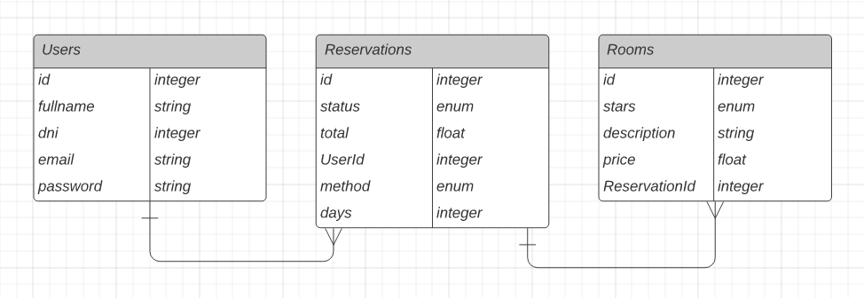

# RESERVAPP API 

Utilizando Node.js y Express Framework se desarrollan los endpoints para un sistema de reservas de habitación de un hotel.

Para levantar el servidor localmente: 

```javascript
npm install
npm start
npm run dev //modo desarrollo con nodemon
```

Para levantar el servidor en un contenedor de Docker:

```
docker compose up
```


## Diagrama Entidad Relación utilizado


se utiliza sequelize y postgreSQL para la aplicación

## Usuarios

Para poder asociar una reserva al cliente/usuario se crean 2 endpoints, para registrarse y para loguearse si ya se encuentra registrado.

> __POST__ /user/register

> __GET__ /user/login

## Habitaciones

Para disponer del control, crear y detallar las habitaciones disponibles se crean 2 endpoints, un POST para crear y un GET para obtener todo lo disponible a ser reservados

> __POST__ /room

> __GET__ /room

## Reservas

Y por ultimo y el principal del negocio se crean 3 endpoints, un POST para que el usuario logueado y con la/las habitacion/es seleccionadas pueda concretar la reserva y realizar el pago, tambien se crea un PUT que recibe por params el id para actualizar el estado de la reserva o cualquier detalle necesario, y finalmente un GET para obtener la lista de todas las reservas actuales con sus relaciones Usuario y Habitación/es

> __POST__ /reservation

> __PUT__ /reservation/:id

> __GET__ /reservation

## Ejemplos de Consumo

Se adjunta en el proyecto una colección de Postman con ejemplos de consumos de la API

> [reservApp.postman_collection](./reservApp.postman_collection.json)